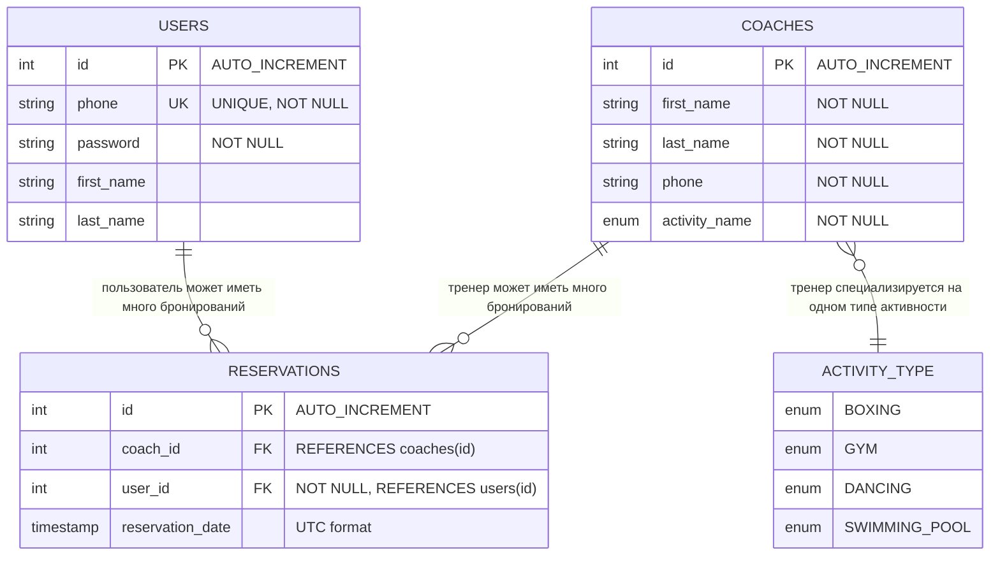

[Диаграмма](https://mermaid.live/edit#pako:eNqtVG1O20AQvcpqJaRWSlAMCY79LzWGWiU2DTYtVSRrFZvEKraj9YaWJpH4kCpVqsQZegNKoaQF0iusb9RZpwmQpPyo6h_2zsyb92Zm19vFjdjzsYp9uhqQJiVhPULwOFt6bQt1R4Z4goihwEObL1AdVxzbcg1Tq-lV3bTr-A6VMBpETdRuxZGPHIF1TOOlo-eQadnIdDY25qFJkryLqQfoR1C7AU2YG5HQnwntkQeR_ugzemtWRXuu_3srd7KPlzep4XHYaDLzIX7UCRFpsGA_YAcuO2jPAz5orqbDNm1XbMMy_6FDgWrEpNFyAbsmsDV9Ta_ppgbzygJ-8iTwnk7ndBKfTlLG9eXQvWSBmEllQegnjIRtRH2I7xMWxJHrESbadGwN7cY0JGxuoxXNNrYNe8e1dzb1-51mM3tmvTbM9Snn-k51yrNaMbVZ3NYro1oFt7tpWRsT6dFiYQHxL_w8PeVXfID4Db_k3_lFeoLSo_Qk_cRv-RBWxxC_4YP7P06vl8_H3Yf7o0Kb_Bcf8uv0M_AN-Tk_S4-BEmzBPQTuy_QY8YEQAtbMCxL8Gx8i_jU9hOUtH2RfyBVr_mM8rvE5_5sy8B2C1i0wH_4_tX6cz_d6U9szI5ceQd-X6UdgOOPX8L4SvOlJpnuUniLAnSHQucgKuEEwloFIQYD_mRnn41nDnDHO4SYNPKwy2vFzOPTh3AgTZwejjlnLh7sAizo8Qt-KovuQ0ybRmzgOx2k07jRbWN0lewlYnbY4iX_uwImX-pHnUy3uRAyrSjnjwGoXv8fqirwoLReU4sqKUpaLxaVSDh9gNV8sL5YUaUlS5IKkLJeKUj-HP2SqhUVZkmS5oJSWy5JcVhS5_xvWlgmP) сущностей базы данных Gym Backend

## Описание сущностей

### USERS (Пользователи)
- **id** - первичный ключ, автоинкремент
- **phone** - уникальный номер телефона для авторизации
- **password** - пароль пользователя
- **first_name** - имя пользователя
- **last_name** - фамилия пользователя

### COACHES (Тренеры)
- **id** - первичный ключ, автоинкремент
- **firstName** - имя тренера
- **lastName** - фамилия тренера
- **phone** - номер телефона тренера
- **activityType** - тип активности (BOXING, GYM, DANCING, SWIMMING_POOL)

### RESERVATIONS (Бронирования)
- **id** - первичный ключ, автоинкремент
- **coach_id** - внешний ключ на таблицу тренеров (может быть NULL)
- **user_id** - внешний ключ на таблицу пользователей (обязательное поле)
- **reservation_date** - дата и время бронирования в UTC формате

### ACTIVITY_TYPE (Типы активностей)
Перечисление возможных типов активностей:
- **BOXING** - бокс
- **GYM** - тренажерный зал
- **DANCING** - танцы
- **SWIMMING_POOL** - бассейн

## Связи

1. **Пользователь → Бронирования**: Один пользователь может иметь множество бронирований (1:N)
2. **Тренер → Бронирования**: Один тренер может иметь множество бронирований (1:N)
3. **Тренер → Тип активности**: Один тренер специализируется на одном типе активности (1:1)

## Особенности

- **Каскадное удаление**: При удалении тренера все связанные бронирования также удаляются
- **Уникальность**: Номер телефона пользователя должен быть уникальным
- **Обязательные поля**: Пароль пользователя, данные тренера и связь с пользователем в бронировании обязательны
- **Временные зоны**: Все даты хранятся в UTC формате для корректной работы с разными часовыми поясами
